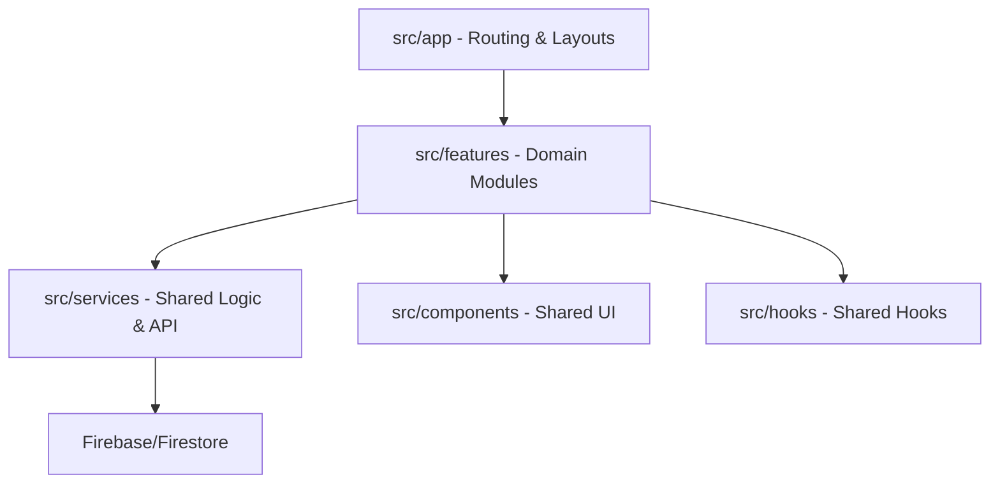

# Architecture Overview

CrowdCAD is designed with a modular, extensible, and domain-centered approach (Domain-Driven Design). It combines **Next.js (App Router)** with a **Feature-based** organization and a service layer inspired by **Clean Architecture**.

## Repository Structure

### 1. `src/features` (The Core Business Logic)
The project is divided into functional domains. Each feature folder (e.g., `dispatch`, `events`, `venues`) is self-contained and includes:
- **components/**: React components specific to this feature.
- **hooks/**: State logic and side effects (e.g., `useDispatchCallsAdvanced.ts`).
- **services/**: (Optional) Data logic specific to the feature.

### 2. `src/services` (Data Abstractions)
Contains reusable services for interacting with Firebase and other external systems.
- **FirestoreService.ts**: An agnostic (generic) base class that handles basic CRUD operations.
- **user.service.ts**: Specialized service for user management, extending or using the generic FirestoreService.

### 3. `src/app` (Presentation Layer)
Powered by the Next.js **App Router**.
- Manages routing, SSR/CSR, and global layouts.
- Pages primarily act as orchestrators, importing components from `features` instead of housing complex business logic.

### 4. Shared Layers
- **`src/components`**: Atomic UI Kit (reusable buttons, inputs, modals).
- **`src/hooks`**: Global utility hooks (authentication, navigation, etc.).

## Key Principles
- **Feature Isolation**: We maintain low coupling between features (e.g., `features/events` should not directly depend on internal details of `features/dispatch`).
- **Clean Service Layer**: UI components should not interact with Firestore directly; instead, they should use abstraction services.
- **Strict Typing**: Heavy use of TypeScript to ensure data consistency and developer productivity.

---
*For detailed repository layout and historical context, refer to the original sections below.*

## Legacy Layout Details

- `src/app/` — Next.js App Router source: top-level layouts and pages.
- `src/components/` — UI components grouped by role.
- `src/hooks/` — shared React hooks.
- `src/lib/` — utilities (e.g., `utils.ts` and `cn()` helpers).
- `dataconnect/` — GraphQL schema and connector definitions.
- `docs/` — user and developer documentation.
